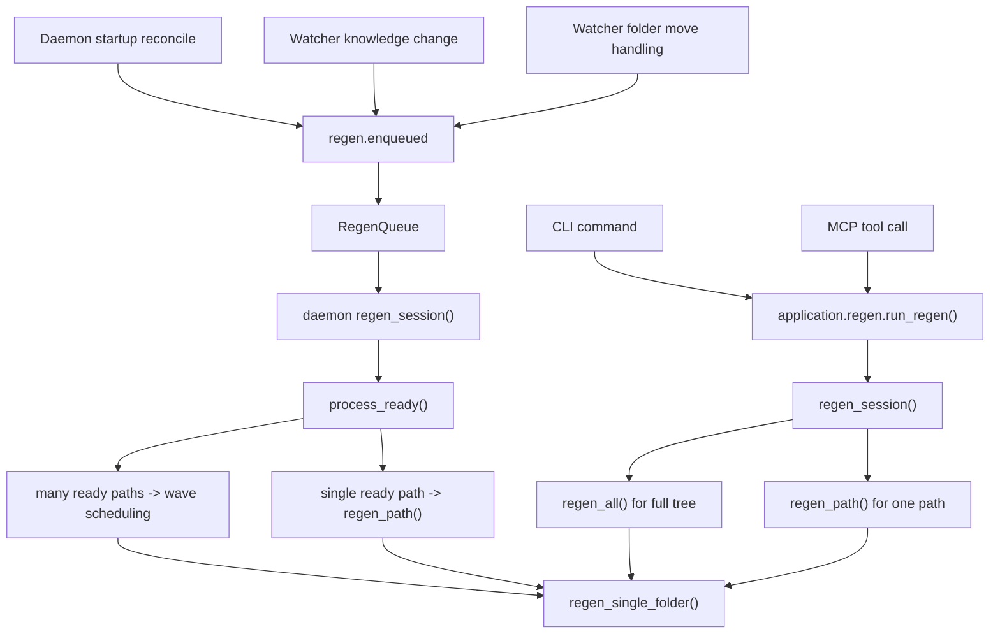
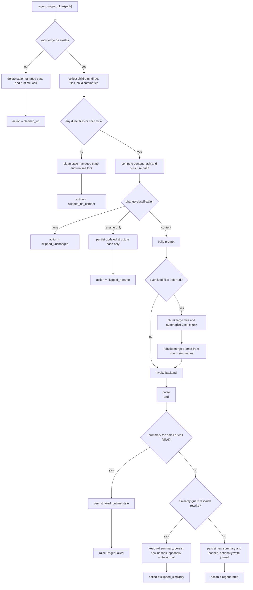
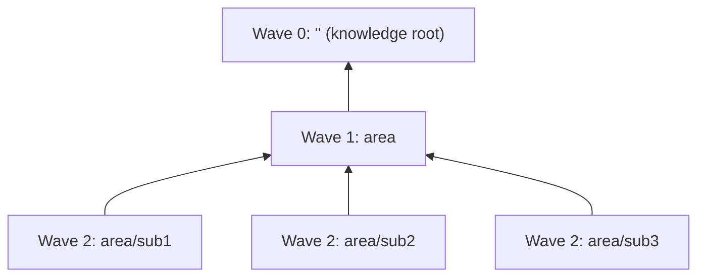

# Regen Flow

This document explains generated-meaning regeneration in brain-sync.

Use it to understand how knowledge-tree change detection, prompt assembly,
queueing, LLM invocation, and durable managed insight updates interact across
CLI and MCP commands, daemon startup reconcile, watcher events, and normal
daemon operation.

This page is explanatory, not normative. For cross-cutting invariants and
behavioural guarantees, see [../RULES.md](../RULES.md). For package ownership
and system-level design rationale, see
[../architecture/ARCHITECTURE.md](../architecture/ARCHITECTURE.md). For the
portable managed artifact layout, see [../brain/README.md](../brain/README.md)
and [../brain/SCHEMAS.md](../brain/SCHEMAS.md). For sync lifecycle entry
paths that can enqueue regen, see [../sync/README.md](../sync/README.md).

## Scope

This page is about the regen subsystem under `src/brain_sync/regen/` and the
current generated-meaning flow for knowledge areas.

It covers:

- single-path regen started explicitly from CLI or MCP
- full-tree regen started explicitly from CLI or MCP
- daemon-owned regen queue processing after startup reconcile
- daemon-owned regen queue processing after watcher-observed knowledge changes
- current prompt assembly, chunking, skip rules, journaling, and persistence

It is not the normative home for:

- source registration, polling, or materialization lifecycle
- user how-to guidance
- future-state refactor proposals
- compatibility or versioning policy

## What Regen Owns

The regen subsystem owns derived-meaning regeneration for the portable
knowledge tree.

Today that includes:

- explicit per-node evaluation before execution
- change classification for one knowledge path
- single-folder regeneration
- leaf-to-root walk-up regeneration
- multi-path wave scheduling
- owner-scoped regen lifecycle sessions
- packaged instructions and prompt resources
- summary and journal artifact generation
- regen token telemetry and operational events

It does not own:

- source sync and provider polling
- watcher filesystem observation itself
- portable-brain write authority outside `brain.repository`
- runtime DB ownership outside `runtime.repository`
- LLM backend implementation details outside `llm/`

## Process Model

There is not always a single regen-owning process.

- CLI commands are short-lived processes.
- MCP tool calls run inside the MCP server process.
- `brain-sync run` starts the long-running daemon process.

Those processes coordinate through the portable brain and machine-local runtime
state. Explicit CLI and MCP regen does not RPC into a running daemon, and the
daemon does not delegate regen back out to CLI or MCP.

Regen entry paths currently fall into three groups:

- `Command`: explicit CLI or MCP regen of one knowledge path or the full tree
- `Daemon Reconcile`: offline knowledge-tree changes discovered at daemon
  startup and enqueued for regen
- `Daemon Watcher`: live knowledge-tree changes observed while the daemon is
  running and enqueued for regen

All explicit regen entry points run inside a `regen_session`, which gives the
invocation a fresh `owner_id` and `session_id`. Full-tree entry points reclaim
stale running rows on entry. Single-path entry points do not reclaim unrelated
stale rows.

## Current Artifacts

For each knowledge area, regen currently manages these co-located artifacts:

- `knowledge/<area>/.brain-sync/insights/summary.md`
- `knowledge/<area>/.brain-sync/journal/YYYY-MM/YYYY-MM-DD.md`
- portable regen hashes and metadata stored with the area's managed state
- runtime regen lifecycle rows in `regen_locks`

The summary is the main derived artifact. The journal is optional and only
written when the model returns non-empty journal content.

## Current Pipeline

The single-folder regen flow is the core unit of behaviour. Both single-path
walk-up and multi-path wave execution eventually call the same
`regen_single_folder()` logic after first evaluating the node with
`evaluate_folder_state()`.

At a high level, the current pipeline is:

1. Resolve the knowledge path and load current portable and runtime state.
2. Evaluate the folder as missing, empty, unchanged, structure-only,
   content-changing, or metadata-backfill.
3. Skip or clean up immediately when no LLM work is needed.
4. Assemble prompt context for content-changing folders.
5. Chunk oversized files when needed, then rebuild a merge prompt.
6. Invoke the configured LLM backend.
7. Parse structured output into summary and optional journal text.
8. Apply the similarity guard.
9. Persist the final summary and updated hashes, then append any journal
   entry.

## Change Classification

Current implementation now separates node evaluation from execution:

- `evaluate_folder_state()` computes the current node inputs and returns an
  explicit evaluation outcome without invoking the backend
- `regen_single_folder()` consumes that evaluation result rather than
  recomputing the same policy inline
- `classify_folder_change()` remains the compatibility wrapper used by
  watcher and reconcile entry paths

Current dirty detection is based on two hashes:

- `content_hash`: captures readable file content plus child summary content
  while ignoring file and directory names
- `structure_hash`: captures child directory names and readable filenames

That split gives regen a current distinction between semantic content churn and
rename-only churn.

The current classification outcomes are:

| Classification | Meaning | Claude call | Durable effect |
|---|---|---|---|
| `none` | content and structure both match current managed state | no | no summary rewrite |
| `rename` | content matches but structure differs | no | structure hash updated |
| `content` | content differs, or no prior managed state exists | yes | summary may be regenerated |

The richer evaluation outcomes now used inside regen are:

| Evaluation outcome | Meaning |
|---|---|
| `missing_path` | knowledge area path is gone and stale managed state should be cleaned |
| `no_content` | no direct files and no currently usable child-summary input |
| `unchanged` | content and structure both match current managed state |
| `structure_only` | parent-visible structure changed but semantic content did not |
| `content_changed` | model-backed regeneration is required |
| `metadata_backfill` | managed hashes need migration/backfill with no durable content change |

A few current reading rules matter:

- missing knowledge directories are treated as content-changing for cleanup
  purposes
- folders with no readable files and no child directories are treated as
  no-content and cleaned up
- rename-only changes do not call the LLM
- a missing `structure_hash` in older managed state triggers a backfill path
  rather than a normal regen

## Prompt Assembly And Context Budgeting

Prompt assembly is deterministic today. The prompt is built in a fixed order
and does not depend on backend-side file discovery.

The current prompt shape is:

1. packaged regen instructions from `INSIGHT_INSTRUCTIONS.md`
2. global context derived from `_core`
3. current node content
4. child summaries when present
5. existing summary when present
6. output contract requiring `
` and `<journal>` XML sections

### Global Context

Global context currently has a special `_core` rule:

- when regenerating `_core`, regen inlines raw readable files from
  `knowledge/_core/`
- when regenerating any other path, regen inlines only
  `knowledge/_core/.brain-sync/insights/summary.md`

That compiled global context is cached in-process and invalidated when the
watcher reports a change for `_core`.

### Direct Files

For direct files in the current knowledge area, regen currently:

- reads readable files only
- preprocesses text files before prompt assembly
- strips base64 inline image payloads into placeholders
- collapses excessive blank lines
- records binary readable files by name without inlining their content

Prompt budgeting is backend-capability-aware but conservative by default:

- regen reads a bounded capability contract from `llm/` rather than hardcoding
  model-name heuristics in the prompt planner
- unknown or standard-capability models stay on a smaller effective planner
  budget
- current `extended_1m` models use a larger effective planner budget, but regen
  still does not treat the full context window as the default target

Direct files are packed before child summaries under that effective budget.
Files are deferred out of the main prompt only when they cannot fit within the
remaining direct-file budget; a file is no longer chunked solely because its
raw character count exceeds `CHUNK_TARGET_CHARS`.

### Child Summaries

Child summaries are loaded from co-located managed summaries under child
areas. They are sorted deterministically and then packed under the same
estimated token budget.

Current loading priority is:

1. packaged instructions and other fixed scaffold
2. direct files for the current node
3. child summaries

Child summaries are omitted when the remaining budget would be exceeded. Regen
logs those omissions and exposes them through prompt-planner diagnostics for
tests and baseline measurement.

### Oversized File Chunking

When a direct file is too large to inline, regen switches to a two-stage flow:

1. split the file into markdown chunks
2. summarize each chunk with a lightweight chunk prompt
3. rebuild the main prompt using those chunk summaries instead of raw file
   content

The merge prompt still uses the same overall structure as the normal prompt.

Current implementation also has a bounded backend-capability seam in `llm/`:

- the backend contract reports a max prompt-token capability and invocation
  settings such as system prompt and tool mode
- regen execution consumes that contract for invocation expectations
- prompt planning also consumes that contract to choose a conservative
  effective budget envelope
- current planner envelopes are intentionally smaller than the reported
  backend ceiling; long context is treated as selective headroom rather than
  a blanket "fill the window" policy

## Structured Output And Journaling

The current output contract requires the model to return exactly two XML
sections:

- `
`
- `<journal>`

Regen parses those sections after invocation:

- the summary becomes the candidate new `summary.md`
- an empty journal section means "no journal entry"
- a non-empty journal section is appended to the area's daily journal file

Journal writing is independent of summary replacement. Today a journal entry
may still be written even when the similarity guard keeps the existing summary.

## Similarity Guard

After a successful model call, regen compares the existing summary with the
new summary using whitespace-normalized text similarity.

If the similarity score exceeds the configured threshold:

- the old summary stays on disk
- the current content and structure hashes are still persisted
- the run completes as `skipped_similarity`
- any non-empty journal text is still written

This is a current anti-churn rule. It prevents trivial rewording from causing
managed summary rewrites.

## Action Outcomes

The single-folder flow currently returns one of these actions:

| Action | Claude call | Summary rewritten | Parent propagation in shared matrix |
|---|---|---|---|
| `regenerated` | yes | yes | yes |
| `skipped_unchanged` | no | no | no |
| `skipped_no_content` | no | managed state cleaned | yes |
| `skipped_rename` | no | no | no |
| `skipped_similarity` | yes | no | no |
| `skipped_backfill` | no | no | no |
| `cleaned_up` | no | managed state cleaned | yes |

`skipped_rename` now means a local structure-only change for the current area:
for example, a file rename inside the folder with no durable content change.
That action updates managed hashes for the current area but does not, by
itself, imply that a parent-visible input changed.

Parent-visible folder renames and moves are handled earlier by sync-owned move
logic, which explicitly enqueues the moved area plus the parent areas whose
child structure changed.

## Walk-Up And Wave Execution

Regen currently has two execution shapes above the single-folder unit:

- `regen_path()`: start at one knowledge path and walk upward until the root
  or a stop condition
- `regen_all()` and queue wave processing: compute depth-ordered waves and
  process paths deepest-first

### Single-Path Walk-Up

For explicit single-path regen and queue batches containing only one ready
path, the system uses the shared propagation matrix:

- run the requested path first
- continue to the parent after `regenerated`, `skipped_no_content`, or
  `cleaned_up`
- stop after `skipped_unchanged`, `skipped_similarity`, `skipped_rename`, or
  `skipped_backfill`

### Multi-Path Wave Scheduling

When multiple ready paths are processed together, regen uses wave topology:

- include each ready path and all of its ancestors
- group those paths by depth
- process the deepest wave first and the root wave last
- only propagate dirtiness upward for actions in the current propagation set

This means the current daemon queue does not recompute a parent until the
relevant child wave has already run.

## Queue Behaviour

The daemon-owned `RegenQueue` adds scheduling behaviour around the regen
engine.

Current queue features are:

- debounce by knowledge path
- post-regen cooldown by knowledge path
- hourly rate limiting
- ownership checks before processing
- retry with bounded backoff
- special handling for Windows-style lock contention errors

Queue processing currently has two paths:

- one ready path: call `regen_path()`
- multiple ready paths: call `regen_single_folder()` through wave scheduling

Queue ownership is runtime-scoped. If regen ownership cannot be acquired for a
path, that branch is skipped rather than forced.

## Persistence Model

Regen spans both persistence planes:

- portable managed artifacts under the brain root
- runtime coordination and telemetry under the runtime DB

Current portable writes include:

- summary persistence through `brain.repository`
- journal append through `brain.repository`
- portable regen hashes and metadata
- cleanup of stale managed insight state when a path becomes empty or missing

Current runtime writes include:

- `regen_locks` rows for `idle`, `running`, and `failed` state tracking
- owner-scoped cleanup of running rows on session exit
- operational events such as `regen.enqueued`, `regen.started`,
  `regen.completed`, and `regen.failed`
- token telemetry in `token_events`

## Observability

Current regen observability is split between operational events, runtime state,
and logs.

### Operational Events

Regen and regen-adjacent paths currently emit operational events including:

- `regen.enqueued`
- `regen.started`
- `regen.completed`
- `regen.failed`
- watcher and reconcile events that explain why a path was enqueued

Those events can carry `knowledge_path`, `session_id`, `owner_id`, outcome, and
details payloads.

### Token Telemetry

Each LLM invocation may record a `token_events` row with:

- operation type
- resource identity
- chunk or non-chunk classification
- model name
- input tokens
- output tokens
- duration
- turn count
- success flag

Chunk summarization calls and final merge calls are recorded separately when a
session ID is available.

### Runtime Locks

`regen_locks` is the current runtime coordination view for knowledge paths.
It records:

- current regen status
- start time for running work
- owning session identity
- failure reason when a run ends in failed state

`regen_session()` reclaims stale running rows only when the caller asks it to.

## Agent Reading Guide

Use this page in the following order:

- read the process model to identify how regen was entered
- read the current pipeline to understand single-folder behaviour
- read change classification and prompt assembly to understand why a path did
  or did not call the LLM
- read walk-up and wave execution to understand ancestor processing
- read queue behaviour and persistence model to understand daemon-owned work
  and runtime coordination

## Interpretation Rules

These are the main reading rules that help agents reason correctly about the
current implementation:

- regen is path-based; the root knowledge area is represented by the empty
  path `""`
- `_core` has a special current role as the source of global semantic context
- rename-only churn updates structure state without calling the LLM
- similarity-based skips still count as successful completed runs
- journal writes are independent of whether the summary is rewritten
- queue wave processing and explicit single-path walk-up share the same
  propagation matrix
- parent-visible folder renames are carried by sync-owned move enqueue paths,
  not by generic `skipped_rename` walk-up
- watcher and reconcile are upstream entry paths into regen, not part of the
  regen engine itself

This page summarizes current regen behaviour for design, maintenance, and
testing. The normative source of truth for system guarantees remains
[../RULES.md](../RULES.md).
