# Sync Lifecycle

This document explains synced-source lifecycle management in brain-sync.

Use it to understand how source registration, local filesystem drift, remote
source drift, and durable `knowledge_state` transitions interact across CLI and
MCP commands, daemon startup, watcher events, and normal polling.

This page is explanatory, not normative. For cross-cutting invariants and user
operation guarantees, see [../RULES.md](../RULES.md). For the normative
`knowledge_state` schema, see [../brain/SCHEMAS.md](../brain/SCHEMAS.md). For
runtime-table and daemon-cache semantics, see
[../runtime/SCHEMAS.md](../runtime/SCHEMAS.md). For package ownership and
system-level design rationale, see
[../architecture/ARCHITECTURE.md](../architecture/ARCHITECTURE.md).

## Scope

This page is about registered synced sources: sources with manifests under
`.brain-sync/sources/` and lifecycle managed by `sync/`.

It is not about plain user-authored files with no source manifest. If a brain
contains only manual files, there is no synced-source lifecycle to manage.
Those files still participate in knowledge-tree reconciliation and regeneration,
but that is a regen and knowledge-tree concern rather than source-management
sync.

## Process Model

There is not always a single `brain-sync` process.

- CLI commands are short-lived processes.
- MCP tool calls run inside the MCP server process.
- `brain-sync run` starts the long-running daemon process.

Those processes coordinate through the portable brain and machine-local runtime
state. Normal CLI and MCP source-management commands do not RPC into a running
daemon, and they do not start one implicitly.

A portable brain may be attached by different processes over time, but the
supported contract allows only one active daemon attachment per brain at once.
A second daemon start against the same brain is refused before it begins
reconcile or polling work. Runtime startup enforces that with a durable
per-brain guard; `daemon.json` remains the current lifecycle snapshot rather
than the exclusion mechanism itself. The normative rule lives in
[../RULES.md](../RULES.md).

For synced sources, the main entry paths are:

- `Command`: explicit CLI or MCP source-management operations.
- `Daemon Watcher`: local filesystem drift observed while the daemon is already
  running.
- `Daemon Reconcile`: local filesystem drift discovered when the daemon starts
  and reconciles portable truth against current disk state.
- `Daemon Poll`: remote source drift discovered while the daemon is polling
  registered sources.

One important split is easy to miss:

- local drift is observed by the watcher while the daemon is running, or by
  reconcile when the daemon starts later
- remote drift is not a watcher concern and is not discovered by startup
  reconcile alone; it is discovered by daemon polling

Another important split is that missing sources are still registered, but they
are excluded from active polling until they are rediscovered locally or
finalized explicitly.

Lifecycle-owning entry paths also carry a session boundary:

- CLI lifecycle commands create a fresh lifecycle session per invocation
- the daemon keeps one lifecycle session for the life of the daemon run
- the MCP server keeps one lifecycle session for the life of the server

That matters most for explicit finalization. Missing confirmation counts may be
inherited from an earlier process, but destructive finalization still requires
a fresh missing confirmation in the current lifecycle session after local
revalidation.

## Event Matrix

This matrix is the applicability view of synced-source lifecycle behavior.

- `x` means the event meaningfully applies from that starting state.
- `unregistered` is a pseudo-state for reasoning about source registration. It
  is not a persisted `knowledge_state` value.
- `Result` is the typical durable outcome. Some rows remain intentionally
  state-dependent, and those cases are called out in `Notes`.

| Origin | Synced Source Event | Scope | Entry Path | `awaiting` | `materialized` | `stale` | `missing` | `unregistered` | Result | Notes |
|---|---|---|---|---|---|---|---|---|---|---|
| CLI/MCP | Add Source | Single File | Command |  |  |  |  | x | `awaiting` | Creates a new manifest plus polling state. |
| CLI/MCP | Update Source | Single File | Command | x | x | x | x |  | unchanged | Updates sync settings and child-discovery intent, not the durable knowledge lifecycle directly. |
| CLI/MCP | Move Source | Single File | Command | x | x | x | x |  | state-dependent | State unchanged except `materialized` -> `stale`. If the source cannot be resolved, the command returns handled `not_found`. If another lifecycle owner already holds the source lease, the command returns handled `lease_conflict` and does not mutate the source. |
| CLI/MCP | Remove Source | Single File | Command | x | x | x | x |  | state-dependent | Usually unregisters the source and may remove the materialized file and source-owned attachments. If the source cannot be resolved, the command returns handled `not_found`. If another lifecycle owner already holds the source lease, the command returns handled `lease_conflict`. |
| CLI/MCP | Reconcile | Knowledge Tree | Command | x | x | x | x |  | conservative repair | Uses the same reconcile engine as daemon startup. `awaiting` usually stays `awaiting`; direct-path present registered sources stay in their current settled state; repaired or rediscovered present sources become `stale`; absent registered sources become or remain `missing`; missing sources that reappear become `stale`. |
| CLI/MCP | Finalize Missing | Single File | Command |  |  |  | x |  | state-dependent | Finalization rechecks local presence first. If the source file is rediscovered locally, the source is restored to `stale` instead of being unregistered. In a new lifecycle session, the first finalize call may still return `pending_confirmation` even when older missing history already exists. |
| User | Synced File Moved | Single File | Daemon Watcher |  | x | x |  |  | `stale` | The watcher observes local drift and reconcile repairs the manifest path to the found file. |
| User | Synced File Deleted | Single File | Daemon Watcher |  | x | x |  |  | `missing` | This is first-stage missing only. Later explicit finalization may unregister the source. |
| User | Source Area Moved | Knowledge Area | Daemon Watcher | x | x | x | x |  | state-dependent | Folder moves have a fast path. `awaiting` stays `awaiting`; `materialized` and `stale` end `stale`; `missing` stays `missing`. |
| User | Source Area Deleted | Knowledge Area | Daemon Watcher | x | x | x | x |  | state-dependent | `awaiting` usually stays `awaiting` because no materialized file was expected. Present registered sources become `missing`; already missing sources stay `missing`. |
| User | Missing Source Rediscovered | Single File | Daemon Watcher |  |  |  | x |  | `stale` | A local reappearance while the daemon is running restores the source to active polling. |
| User | Synced File Moved | Single File | Daemon Reconcile |  | x | x |  |  | `stale` | Same repair path as the watcher case, but discovered on the next daemon start. |
| User | Synced File Deleted | Single File | Daemon Reconcile |  | x | x |  |  | `missing` | Offline delete discovered at daemon startup. |
| User | Source Area Moved | Knowledge Area | Daemon Reconcile | x | x | x | x |  | state-dependent | Same state behavior as the watcher row, but discovered at daemon startup. |
| User | Source Area Deleted | Knowledge Area | Daemon Reconcile | x | x | x | x |  | state-dependent | Same state behavior as the watcher row, but discovered at daemon startup. |
| User | Missing Source Rediscovered | Single File | Daemon Reconcile |  |  |  | x |  | `stale` | Offline reappearance discovered at daemon startup. |
| Remote Source | Changed | Single File | Daemon Poll | x | x | x |  |  | `materialized` | Successful poll and materialization settle the source back to `materialized`. |
| Remote Source | Unchanged | Single File | Daemon Poll |  | x |  |  |  | `materialized` | The unchanged fast path only applies to already materialized sources. `awaiting` and `stale` still poll, but they usually proceed to rematerialization rather than staying unchanged. |
| Remote Source | Missing/404 | Single File | Daemon Poll | x | x | x |  |  | `missing` | Remote disappearance marks the source missing and removes it from active polling until rediscovery or explicit finalization. |

### Why This Matrix Matters

For agents and maintainers, the main job of this matrix is to answer four
questions quickly:

1. What kind of event happened?
2. Which process boundary notices it?
3. Which starting states does that event meaningfully apply to?
4. What durable lifecycle outcome should follow?

That makes the matrix useful both as architecture guidance and as the starting
point for a future scenario-to-test coverage map.

## State Diagram

This is the compact durable-state view that sits underneath the event matrix.
The matrix tells you which kinds of events apply. The state diagram tells you
the typical lifecycle transitions those events produce.

Matrix-backed labels use:

- `Origin - Synced Source Event - Entry Path`

For brevity, the state diagram groups `Daemon Watcher` and `Daemon Reconcile`
as `Watcher/Reconcile` when they represent the same synced-source event and the
same resulting state transition.

```mermaid
stateDiagram-v2
    [*] --> Awaiting: CLI/MCP - Add Source - Command

    Awaiting --> Awaiting: CLI/MCP - Update Source - Command
    Awaiting --> Awaiting: CLI/MCP - Move Source - Command
    Awaiting --> Awaiting: CLI/MCP - Reconcile - Command
    Awaiting --> Awaiting: User - Source Area Moved - Watcher/Reconcile
    Awaiting --> Awaiting: User - Source Area Deleted - Watcher/Reconcile
    Awaiting --> Materialized: Remote Source - Changed - Daemon Poll
    Awaiting --> Materialized: *Sync Daemon* - Materialization - Daemon Poll
    Awaiting --> Missing: Remote Source - Missing/404 - Daemon Poll
    Awaiting --> Unregistered: CLI/MCP - Remove Source - Command

    Materialized --> Materialized: CLI/MCP - Update Source - Command
    Materialized --> Materialized: Remote Source - Changed - Daemon Poll
    Materialized --> Materialized: Remote Source - Unchanged - Daemon Poll
    Materialized --> Stale: CLI/MCP - Move Source - Command
    Materialized --> Materialized: CLI/MCP - Reconcile - Command
    Materialized --> Stale: User - Synced File Moved - Watcher/Reconcile
    Materialized --> Stale: User - Source Area Moved - Watcher/Reconcile
    Materialized --> Missing: User - Synced File Deleted - Watcher/Reconcile
    Materialized --> Missing: User - Source Area Deleted - Watcher/Reconcile
    Materialized --> Missing: Remote Source - Missing/404 - Daemon Poll
    Materialized --> Unregistered: CLI/MCP - Remove Source - Command

    Stale --> Stale: CLI/MCP - Update Source - Command
    Stale --> Stale: CLI/MCP - Move Source - Command
    Stale --> Stale: CLI/MCP - Reconcile - Command
    Stale --> Stale: User - Synced File Moved - Watcher/Reconcile
    Stale --> Stale: User - Source Area Moved - Watcher/Reconcile
    Stale --> Materialized: Remote Source - Changed - Daemon Poll
    Stale --> Materialized: *Sync Daemon* - Materialization - Daemon Poll
    Stale --> Missing: User - Synced File Deleted - Watcher/Reconcile
    Stale --> Missing: User - Source Area Deleted - Watcher/Reconcile
    Stale --> Missing: Remote Source - Missing/404 - Daemon Poll
    Stale --> Unregistered: CLI/MCP - Remove Source - Command

    Missing --> Missing: CLI/MCP - Update Source - Command
    Missing --> Missing: CLI/MCP - Move Source - Command
    Missing --> Missing: User - Source Area Moved - Watcher/Reconcile
    Missing --> Missing: User - Source Area Deleted - Watcher/Reconcile
    Missing --> Stale: CLI/MCP - Reconcile - Command
    Missing --> Stale: User - Missing Source Rediscovered - Watcher/Reconcile
    Missing --> Stale: CLI/MCP - Finalize Missing - Command
    Missing --> Unregistered: CLI/MCP - Finalize Missing - Command
    Missing --> Unregistered: CLI/MCP - Remove Source - Command
```

Two practical readings help:

- `stale` is the "path or content is no longer trusted; rematerialize on next
  poll" state.
- `missing` is the "still registered, but do not treat as present or actively
  poll" state.

Handled `lease_conflict` and `pending_confirmation` results are command
outcomes rather than durable `knowledge_state` values, so they do not appear
as separate nodes in the state diagram.

## Agent Reading Guide

Use this page in the following order:

- read the event matrix as the compact inventory of externally meaningful
  synced-source lifecycle events
- read the state diagram as the compact transition view of those same events
- treat `*Sync Daemon* - Materialization - Daemon Poll` as the only intentional
  state-diagram add-on that does not correspond to an event-matrix row
- when comparing the matrix and the diagram, remember that
  `Watcher/Reconcile` in the diagram means the union of the `Daemon Watcher`
  and `Daemon Reconcile` rows in the matrix when those rows cause the same
  state transition

For tests, the useful pattern is:

- choose a matrix row
- choose one supported starting state from that row
- assert the durable resulting state from the matrix and diagram
- add process-model coverage where needed:
  watcher while daemon is running, reconcile on daemon start, or poll during
  daemon operation

## Interpretation Rules

These are the main reading rules that help agents reason correctly:

- `Add Source` is the entry into `awaiting`.
- `awaiting`, `materialized`, and `stale` remain eligible for daemon polling;
  `missing` does not.
- watcher and reconcile observe local filesystem drift; daemon poll observes
  remote source drift.
- `missing` is still registered state, not removal.
- `Finalize Missing` is only meaningful from `missing`, and it can either
  unregister the source, remain `missing` with `pending_confirmation`, or
  restore it to `stale` if the file is rediscovered during preflight.
- `Remove Source` is the explicit unregistering path from any registered state.
- if a source path changes without durable content being resettled, the normal
  result is `stale`, not immediate `materialized`.
- watcher and reconcile are observational paths: if they encounter an active
  conflicting lifecycle lease, they revalidate and skip that source instead of
  forcing a repair over the lease holder.
- operational events are useful for diagnostics and testing, but they are
  best-effort rather than exact-once audit records.

This page summarizes those interpretation rules for design and testing. The
normative source of truth for guarantees and state contracts remains
[../RULES.md](../RULES.md) and [../brain/SCHEMAS.md](../brain/SCHEMAS.md).
